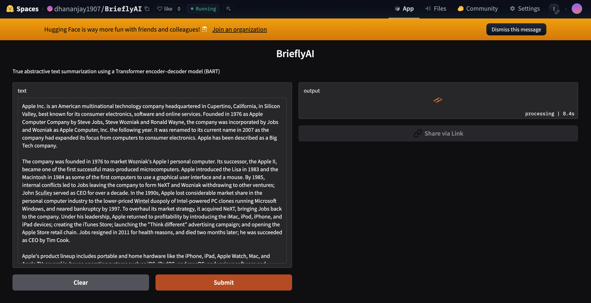

# BrieflyAI 🚀
### True Abstractive Text Summarization Platform

BrieflyAI is a **true abstractive text summarization** web application built using
**Transformer encoder–decoder models**. It generates concise, human-like summaries
from long-form text and is deployed live on **Hugging Face Spaces (Free tier)**.

---

## 🧠 Model
- **facebook/bart-large-cnn**
- Transformer encoder–decoder architecture
- True abstractive summarization (not extractive)

---

## ✨ Features
- Paste long-form text and generate summaries
- True abstractive summarization
- Clean Gradio-based web UI
- Free cloud deployment (Hugging Face Spaces)

---

## 🖼️ Screenshots

### Application Interface

### Generated Summary Output

---

## 🔗 Live Demo
👉 https://huggingface.co/spaces/dhananjay1907/BrieflyAI

---

## 🧱 Tech Stack
- Python
- Hugging Face Transformers
- PyTorch
- Gradio
- Hugging Face Spaces

---

## 📌 Notes
- First request may be slow due to model cold start on free tier
- Subsequent requests are faster
- Space may sleep after inactivity (expected behavior)
